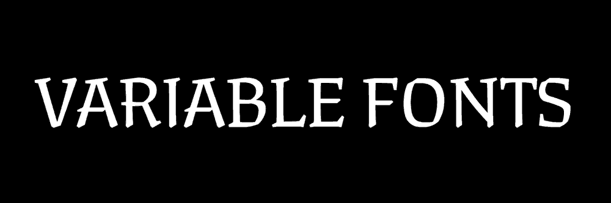

# Variable Fonts

- Type@Cooper Public Workshop Summer 2021
- 2:00–5:00pm EDT, 2 Sundays in June
- Instructors: [Lynne Yun](https://lynneyun.com), [Kevin Yeh](http://kevbk.com)
- Course Discussion: Slack

## Course Description

Variable fonts have been a topic of growing curiosity in the type world — but how do we use them on the web? Have you ever thought about building your own variable type tester, or wondered how they could be brought to life through code?

Over four evenings, this beginner-friendly course will cover the fundamentals of programming using both HTML+CSS web basics and P5.js, a beginner-friendly Javascript framework. We’ll explore how to utilize these tools with variable fonts to create interesting digital experiences, opening new doors and finding fresh avenues for experimentation … and fun!

This is an intermediate level course, and students are expected to have a basic knowledge of programming concepts and the fundamentals of HTML, CSS, and Javascript. P5.js will be the main programming library for the course, a beginner-friendly Javascript framework. 

Techniques covered in this course will include time and interaction-based CSS manipulation and animation on the web using variable font features.

## Topic Sections

## Section 0: Before the First Week
- Make an account for the [P5.js Web Editor](https://editor.p5js.org/)
- Join the Generative Type Slack 

## Section 1: Roundtables and HTML/CSS

- 👋 Roundtable Intros & Housekeeping
- "Talking to Machines" Lecture
- Variable Fonts on the web using HTML and CSS

### Variable Font Examples
- [SFSymphony Brand Design](https://www.wearecollins.com/work/sf-symphony/) by COLLINS
- [GT Maru Typeface](https://www.gt-maru.com/)
- [Variable Font Rendering in 3D](https://twitter.com/kmkota0/status/1160929260271525888)
- [Interview with Bianca Berning](https://www.itsnicethat.com/news/dalton-maag-variable-fonts-opinion-graphic-design-100220)

### Color Font Examples
- [Merit Badge](https://djr.com/merit-badge) by David Jonathan Ross
- [Rocher Color](https://www.harbortype.com/rocher-color-making-a-variable-color-font/) by Harbortype
- [Typearture Variable Color Initials](https://www.typearture.com/variable-color-font-initials/) by Typearture
- [Whirly Birdie](https://whirlybirdie.com/) by Alex Tomlinson and Richard Yee
- [Anicons](https://typogram.github.io/Anicons/index.html) by Wenting Zhang and Hua Shu

### Inspecting Variable Fonts:
- https://wakamaifondue.com/
- Firefox Font Inspector

### Finding (free) variable fonts:
- https://fontsarena.com/tag/variable-font/
- https://v-fonts.com/
- https://fonts.google.com/variablefonts
- https://www.axis-praxis.org
- https://www.fontshare.com/

### Sketch Collection
- [Part 1](https://editor.p5js.org/kyeah/sketches/5pDxUr4Q-)
- [Part 2 (inhale/exhale)](https://editor.p5js.org/kyeah/sketches/wDL2Dew9l)
- [Part 2.5 (hover to reveal)](https://editor.p5js.org/kyeah/sketches/1QyDvw5dq)
- [Part 3 (individual letter animations)](https://editor.p5js.org/kyeah/sketches/5DhcXolZa)
- [Extra Part 4 (advanced grid animation)](https://editor.p5js.org/kyeah/sketches/3wWYfAyrK)
